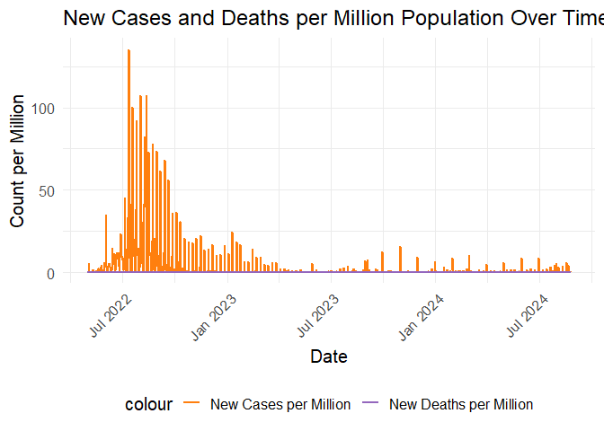
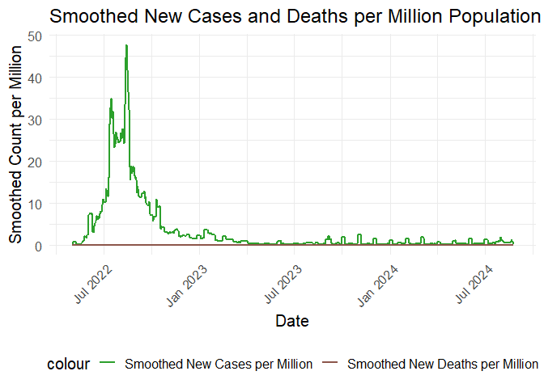
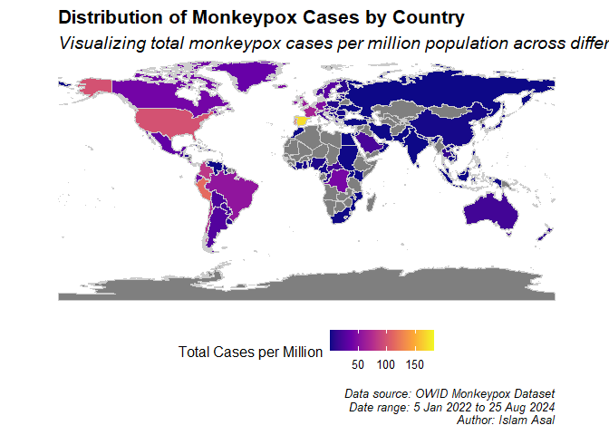
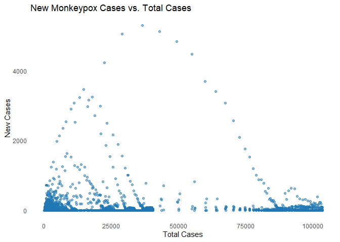
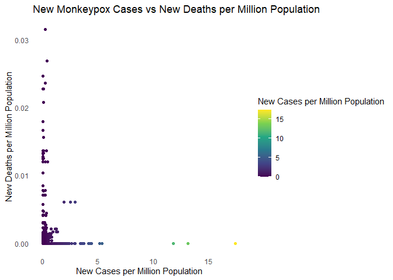

Mpox Dataset Analysis
================
Islam Asal
Aug 31, 2024

``` r
knitr::opts_chunk$set(fig.path='Figs/')
```

## Load Necessary Libraries

We load the necessary libraries for data manipulation (`dplyr`), date
handling (`lubridate`), spatial data handling (`sf`), mapping (`ggmap`),
data diagnosis (`dlookr`), and plotting (`ggplot2`, `scales`).

## Read and Prepare Data

``` r
# Read the data
df <- read.csv('mpox.csv')

# Convert date column to Date type and adjust the date range
df$date <- as.Date(df$date, format="%m/%d/%Y")

# Diagnose the data
dlookr::diagnose(df)
```

    ## # A tibble: 15 x 6
    ##    variables        types missing_count missing_percent unique_count unique_rate
    ##    <chr>            <chr>         <int>           <dbl>        <int>       <dbl>
    ##  1 location         char~             0               0          128    0.00150 
    ##  2 date             Date              0               0          848    0.00995 
    ##  3 iso_code         char~             0               0          122    0.00143 
    ##  4 total_cases      inte~             0               0         2799    0.0328  
    ##  5 total_deaths     inte~             0               0          152    0.00178 
    ##  6 new_cases        inte~             0               0          413    0.00484 
    ##  7 new_deaths       inte~             0               0           10    0.000117
    ##  8 new_cases_smoot~ nume~             0               0          764    0.00896 
    ##  9 new_deaths_smoo~ nume~             0               0           13    0.000152
    ## 10 new_cases_per_m~ nume~             0               0         1182    0.0139  
    ## 11 total_cases_per~ nume~             0               0        21964    0.258   
    ## 12 new_cases_smoot~ nume~             0               0          740    0.00868 
    ## 13 new_deaths_per_~ nume~             0               0          151    0.00177 
    ## 14 total_deaths_pe~ nume~             0               0         5629    0.0660  
    ## 15 new_deaths_smoo~ nume~             0               0          107    0.00126

``` r
# Extract month name from the date
df$month <- month.name[month(df$date)]
```

We read the data from a CSV file, convert the date column to `Date`
type, and extract month names from the date. We also perform data
diagnosis to identify potential issues.

## 1. Top 10 Countries with the Highest Total Number of Cases and Deaths

### Top 10 Countries by Total Cases

``` r
# Top 10 countries by total cases
top_10_cases <- df %>%
  group_by(location) %>%
  summarise(total_cases = max(total_cases, na.rm = TRUE)) %>%
  arrange(desc(total_cases)) %>%
  slice(1:10)

# Plotting Top 10 Countries by Cases
ggplot(top_10_cases, aes(x = reorder(location, -total_cases), y = total_cases)) +
  geom_bar(stat = "identity", fill = "#1f77b4") +
  coord_flip() +
  labs(title = "Top 10 Countries with the Highest Total Cases",
       x = "Country", y = "Total Cases") +
  theme_minimal(base_size = 15) +
  theme(panel.grid = element_blank())
```

<!-- -->

We identify and plot the top 10 countries with the highest total number
of monkeypox cases, using a blue color for the bars and removing grid
lines for a cleaner look.

### Top 10 Countries by Total Deaths

``` r
# Top 10 countries by total deaths
top_10_deaths <- df %>%
  group_by(location) %>%
  summarise(total_deaths = max(total_deaths, na.rm = TRUE)) %>%
  arrange(desc(total_deaths)) %>%
  slice(1:10)

# Plotting Top 10 Countries by Deaths
ggplot(top_10_deaths, aes(x = reorder(location, -total_deaths), y = total_deaths)) +
  geom_bar(stat = "identity", fill = "#d62728") +
  coord_flip() +
  labs(title = "Top 10 Countries with the Highest Total Deaths",
       x = "Country", y = "Total Deaths") +
  theme_minimal(base_size = 15) +
  theme(panel.grid = element_blank())
```

<!-- -->

Similarly, we plot the top 10 countries with the highest total deaths,
using a red color for the bars.

## 2. Visualizing the Change in Total Cases Worldwide Over Time

``` r
# Convert date column to Date type and filter for 'World'
df$date <- as.Date(df$date)
global_cases <- df %>%
  filter(location == "World") %>%
  select(date, total_cases)

# Plot total cases over time
ggplot(global_cases, aes(x = date, y = total_cases)) +
  geom_line(color = "#1f77b4") +
  labs(title = "Change in Total Cases Worldwide Over Time",
       x = "Date", y = "Total Cases") +
  scale_x_date(labels = date_format("%b %Y")) +
  theme_minimal(base_size = 15) +
  theme(axis.text.x = element_text(angle = 45, hjust = 1))
```

<!-- -->

This plot shows the total number of monkeypox cases worldwide over time.
The line is colored dark blue, and the x-axis labels are angled for
readability.

## 3. Total Case Numbers by Continent

``` r
# Filtering data by continents
continents <- c('Africa', 'Asia', 'Europe', 'North America', 'South America', 'Oceania')
continent_cases <- df %>%
  filter(location %in% continents) %>%
  group_by(location) %>%
  summarise(total_cases = max(total_cases, na.rm = TRUE))

# Plot total cases by continent
ggplot(continent_cases, aes(x = reorder(location, -total_cases), y = total_cases)) +
  geom_bar(stat = "identity", fill = "#2ca02c") +
  coord_flip() +
  labs(title = "Total Cases by Continent",
       x = "Continent", y = "Total Cases") +
  theme_minimal(base_size = 15) +
  theme(panel.grid = element_blank())
```

<!-- -->

We plot total cases by continent, using a green color for the bars.

## 4. Top 10 Countries by Case Rate per Million People

``` r
# Top 10 countries by case rate per million
cases_per_million <- df %>%
  group_by(location) %>%
  summarise(total_cases_per_million = max(total_cases_per_million, na.rm = TRUE)) %>%
  arrange(desc(total_cases_per_million)) %>%
  slice(1:10)

# Plot cases per million by country
ggplot(cases_per_million, aes(x = reorder(location, -total_cases_per_million), y = total_cases_per_million)) +
  geom_bar(stat = "identity", fill = "#9467bd") +
  coord_flip() +
  labs(title = "Top 10 Countries by Case Rate per Million People",
       x = "Country", y = "Cases per Million") +
  theme_minimal(base_size = 15) +
  theme(panel.grid = element_blank())
```

<!-- -->

This plot highlights the top 10 countries based on the case rate per
million people, with bars colored purple.

## 5. Total Cases and Deaths in Africa Over Time

``` r
# Filter for Africa data
africa_data <- df %>%
  filter(location == "Africa") %>%
  select(date, total_cases, total_deaths) %>%
  group_by(date) %>%
  summarise(total_cases = sum(total_cases, na.rm = TRUE),
            total_deaths = sum(total_deaths, na.rm = TRUE))

# Plot total cases and deaths over time for Africa
ggplot(africa_data, aes(x = date)) +
  geom_line(aes(y = total_cases, color = "Total Cases"), size = 1) +
  geom_line(aes(y = total_deaths, color = "Total Deaths"), size = 1) +
  scale_color_manual(values = c("Total Cases" = "#1f77b4", "Total Deaths" = "#d62728")) +
  labs(title = "Total Cases and Deaths in Africa Over Time",
       x = "Date", y = "Count") +
  scale_x_date(labels = date_format("%b %Y")) +
  theme_minimal(base_size = 15) +
  theme(legend.position = "bottom", axis.text.x = element_text(angle = 45, hjust = 1))
```

<!-- -->

We plot the total number of cases and deaths in Africa over time, using
blue for cases and red for deaths.

## 6. New Cases and Deaths per Million Population Over Time

``` r
# Aggregating new cases and deaths per million
new_cases_deaths <- df %>%
  group_by(date) %>%
  summarise(new_cases_per_million = sum(new_cases_per_million, na.rm = TRUE),
            new_deaths_per_million = sum(new_deaths_per_million, na.rm = TRUE))

# Plot new cases and deaths per million over time
ggplot(new_cases_deaths, aes(x = date)) +
  geom_line(aes(y = new_cases_per_million, color = "New Cases per Million"), size = 1) +
  geom_line(aes(y = new_deaths_per_million, color = "New Deaths per Million"), size = 1) +
  scale_color_manual(values = c("New Cases per Million" = "#ff7f0e", "New Deaths per Million" = "#9467bd")) +
  labs(title = "New Cases and Deaths per Million Population Over Time",
       x = "Date", y = "Count per Million") +
  scale_x_date(labels = date_format("%b %Y")) +
  theme_minimal(base_size = 15) +
  theme(legend.position = "bottom", axis.text.x = element_text(angle = 45, hjust = 1))
```

<!-- -->

This plot visualizes new cases and deaths per million population over
time, with distinct colors for each metric.

## 7. Smoothed Averages of New Cases and Deaths per Million Population Over Time

``` r
# Aggregating smoothed averages of new cases and deaths per million
smoothed_cases_deaths <- df %>%
  group_by(date) %>%
  summarise(new_cases_smoothed_per_million = sum(new_cases_smoothed_per_million, na.rm = TRUE),
            new_deaths_smoothed_per_million = sum(new_deaths_smoothed_per_million, na.rm = TRUE))

# Plot smoothed averages of new cases and deaths per million over time
ggplot(smoothed_cases_deaths, aes(x = date)) +
  geom_line(aes(y = new_cases_smoothed_per_million, color = "Smoothed New Cases per Million"), size = 1) +
  geom_line(aes(y = new_deaths_smoothed_per_million, color = "Smoothed New Deaths per Million"), size = 1) +
  scale_color_manual(values = c("Smoothed New Cases per Million" = "#2ca02c", "Smoothed New Deaths per Million" = "#8c564b")) +
  labs(title = "Smoothed New Cases and Deaths per Million Population Over Time",
       x = "Date", y = "Smoothed Count per Million") +
  scale_x_date(labels = date_format("%b %Y")) +
  theme_minimal(base_size = 15) +
  theme(legend.position = "bottom", axis.text.x = element_text(angle = 45, hjust = 1))
```

<!-- -->

This plot shows smoothed averages of new cases and deaths per million
population, with green and brown colors.

## World Map with Monkeypox Cases

``` r
# Read world map shapefile
world <- st_read("TM_WORLD_BORDERS-0.3.shp")
```

    ## Reading layer `TM_WORLD_BORDERS-0.3' from data source 
    ##   `C:\Users\Esso\Desktop\R_Projects\Mpox\TM_WORLD_BORDERS-0.3.shp' 
    ##   using driver `ESRI Shapefile'
    ## Simple feature collection with 246 features and 11 fields
    ## Geometry type: MULTIPOLYGON
    ## Dimension:     XY
    ## Bounding box:  xmin: -180 ymin: -90 xmax: 180 ymax: 83.6236
    ## Geodetic CRS:  WGS 84

``` r
# Join world map with data
world_data <- world %>%
  left_join(df %>%
              select(iso_code, total_cases_per_million) %>%
              group_by(iso_code) %>%
              summarise(total_cases_per_million = max(total_cases_per_million, na.rm = TRUE)), 
            by = c("iso3" = "iso_code"))

# Plot world map
ggplot(data = world_data) +
  geom_sf(aes(fill = total_cases_per_million), color = "gray80", size = 0.3) +
  scale_fill_viridis_c(option = "C", name = "Total Cases per Million", 
                       breaks = scales::pretty_breaks(n = 5), 
                       labels = scales::label_comma()) +
  labs(title = "Distribution of Monkeypox Cases by Country",
       subtitle = "Visualizing total monkeypox cases per million population across different countries.",
       caption = "Data source: OWID Monkeypox Dataset\nDate range: 5 Jan 2022 to 25 Aug 2024\nAuthor: Islam Asal") +
  theme_minimal(base_size = 14) +
  theme(
    legend.position = "bottom",
    legend.title = element_text(size = 12),
    legend.text = element_text(size = 10),
    plot.title = element_text(size = 16, face = "bold"),
    plot.subtitle = element_text(size = 14, face = "italic"),
    plot.caption = element_text(size = 10, face = "italic"),
    axis.text = element_blank(),
    axis.title = element_blank(),
    panel.grid = element_blank(),
    panel.border = element_blank()
  ) +
  coord_sf(expand = FALSE)
```

<!-- -->

We create a world map showing the distribution of monkeypox cases by
country. The map uses a color scale to represent cases per million, with
a minimalist theme.

## Scatter Plots

### New Cases vs. Total Cases

``` r
# Scatter plot: New Cases vs. Total Cases
ggplot(df, aes(x = total_cases, y = new_cases)) +
  geom_point(alpha = 0.5, color = "#1f77b4") +
  labs(title = "New Monkeypox Cases vs. Total Cases", x = "Total Cases", y = "New Cases") +
  theme_minimal() +
  theme(panel.grid = element_blank())
```

<!-- -->

This scatter plot compares new monkeypox cases against total cases, with
points colored blue and no grid lines.

### New Cases Smoothed vs. New Deaths Smoothed

``` r
# Scatter plot: New Cases Smoothed vs. New Deaths Smoothed
ggplot(df, aes(x = new_cases_smoothed_per_million, y = new_deaths_smoothed_per_million, color = new_cases_smoothed_per_million)) +
  geom_point() +
  scale_color_viridis_c() +
  labs(title = "New Monkeypox Cases vs New Deaths per Million Population", 
       x = "New Cases per Million Population", 
       y = "New Deaths per Million Population", 
       color = "New Cases per Million Population") +
  theme_minimal() +
  theme(panel.grid = element_blank())
```

<!-- -->

The final scatter plot shows the relationship between smoothed new
monkeypox cases and smoothed new deaths per million population, using a
color gradient and a minimalist theme. \`\`\`

This R Markdown document converts your R script into a structured report
with explanations and enhanced plot aesthetics.
